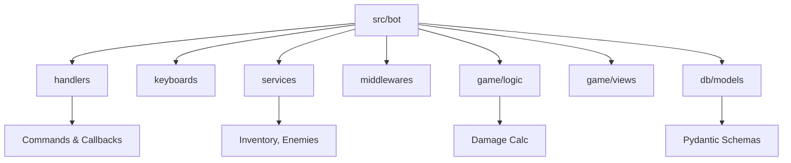

## Overview

CometFall brings a thrilling text-based MMORPG experience directly into Telegram. You battle enemies, upgrade your sword, collect drops, buy weapons, and compete with other players—all without leaving the chat. Built by TeraCodeFrame, this modern project uses advanced programming practices for smooth, engaging gameplay.

Start playing instantly by messaging [`@CometFall_bot`](https://t.me/CometFall_bot).

## Key Features

CometFall packs core MMORPG elements into a seamless Telegram bot:

<Columns cols={3}>
  <Card title="Combat System" icon="sword">
    Fight enemies with calculated damage and armor. Level up your character through intense battles.
  </Card>
  <Card title="Inventory Management" icon="package">
    Collect drops, manage items, and purchase gear. Services handle inventory logic efficiently.
  </Card>
  <Card title="Player Competition" icon="users">
    Compete on leaderboards and rival other players in real-time progression.
  </Card>
</Columns>

<Callout kind="tip">
  Focus on fun: No downloads or apps needed—just pure text-based adventure in Telegram.
</Callout>

## Technology Stack

CometFall leverages a robust Python-based stack for scalability and performance:

<Tabs>
  <Tab title="Framework & Bot" icon="code">
    Aiogram powers the Telegram bot with async handlers for fast responses.
  </Tab>
  <Tab title="Database" icon="database">
    Tortoise ORM with PostgreSQL manages users, items, and enemies efficiently.
  </Tab>
  <Tab title="Data Validation" icon="check-circle">
    Pydantic schemas ensure strict validation for game attributes like health and damage.
  </Tab>
</Tabs>

Here's a sample database model for users:

<CodeGroup tabs="Python">
  ```python
  from tortoise.models import Model
  from tortoise import fields

  class User(Model):
      id = fields.BigIntField(pk=True)
      telegram_id = fields.BigIntField(unique=True)
      username = fields.CharField(max_length=255)
      level = fields.IntField(default=1)
      health = fields.IntField(default=100)
      damage = fields.IntField(default=10)

      class Meta:
          table = "users"
  ```
</CodeGroup>

## Project Structure

The codebase follows a clean, modular architecture:



<Expandable title="Detailed Directory Tree" default-open="false">

```
src/
 └─ bot/
     ├─ handlers/      # Commands and callbacks
     ├─ keyboards/     # Inline keyboards
     ├─ services/      # Inventory, enemies, drops
     ├─ middlewares/   # Checks, logging
     ├─ game/
     │   ├─ logic/     # Damage, armor calculations
     │   ├─ views/     # Readable message formatting
     │   └─ config.py  # Game constants
     ├─ db/
     │   ├─ models.py  # Users, Items, Enemies
     │   └─ schemas/   # Pydantic validation
     └─ config.py      # Env vars, text mappings
```

</Expandable>

## Quick Start

Get into the action in minutes:

<Steps>
  <Step title="Launch Bot" icon="rocket">
    Open Telegram and search for [`@CometFall_bot`](https://t.me/CometFall_bot).
    Send `/start` to begin.
  </Step>
  <Step title="First Battle" icon="sword">
    Use `/fight` to challenge an enemy. Watch your damage and health in action.
  </Step>
  <Step title="Upgrade Gear" icon="shopping-bag">
    Collect drops with `/inventory`, then buy weapons via `/shop`.
  </Step>
  <Step title="Compete" icon="trophy">
    Check leaderboards with `/top` and climb the ranks.
  </Step>
</Steps>

## Next Steps

<Columns cols={2}>
  <Card title="Game Guides" icon="book-open" href="/quickstart">
    Dive deeper into mechanics and strategies.
  </Card>
  <Card title="Development" icon="code" href="https://t.me/TeraCodeFrame" target="_blank">
    Join the team discussion.
  </Card>
</Columns>

<Callout kind="success">
  Ready to conquer CometFall? Launch [`@CometFall_bot`](https://t.me/CometFall_bot) now!
</Callout>