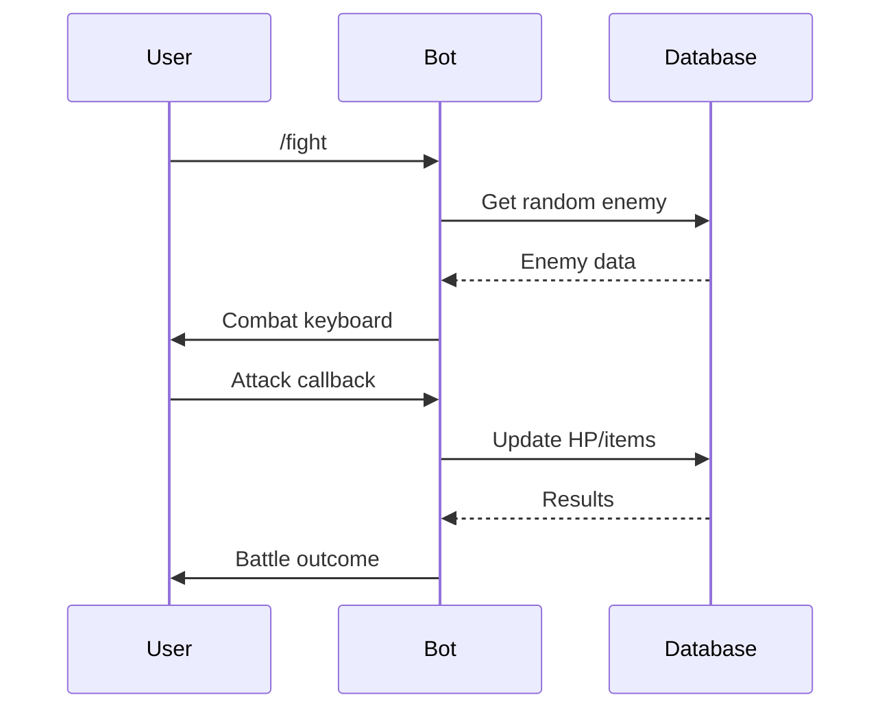

## Overview

CometFall delivers a text-based MMORPG experience directly in Telegram. You battle enemies, upgrade your sword, collect drops, buy weapons, and compete with other players—all without leaving the chat. Start by messaging `@CometFall_bot` to begin.

This guide covers player interactions and developer extensions using Aiogram handlers, keyboards, and services. Follow the steps to launch sessions, navigate commands, process callbacks, and customize features.

<Callout kind="tip">
  Join `@CometFall_bot` and send `/start` to play immediately. For development, clone the repo from `@TeraCodeFrame`.
</Callout>

## Starting a New Game Session

Launch your adventure with these steps. The bot uses Aiogram to handle initial messages and register users in the PostgreSQL database via Tortoise ORM.

<Steps>
  <Step title="Message the Bot" icon="message-circle">
    Open Telegram and search for `@CometFall_bot`. Send `/start` to initialize your profile.
  </Step>
  <Step title="Register User" icon="user-plus">
    The bot creates a `User` model entry with default stats: health `{100}`, sword `{1}`, gold `{0}`.
  </Step>
  <Step title="View Stats" icon="bar-chart">
    Use `/stats` to see your current level, HP, and inventory.
  </Step>
  <Step title="Enter Combat" icon="sword">
    Send `/fight` to battle a random enemy from the `Enemies` model.
  </Step>
</Steps>

## Navigating Core Commands

Access combat and inventory via inline keyboards. The `keyboards` module generates buttons, while `services` handle logic like damage calculation.

<Tabs>
  <Tab title="Combat" icon="zap">
    Send `/fight` to engage. The bot selects an enemy and shows InlineKeyboardMarkup with "Attack" and "Flee".

    ```python
    from aiogram.types import InlineKeyboardMarkup, InlineKeyboardButton
    from src.bot.services.enemies import get_random_enemy

    async def combat_keyboard(enemy):
        keyboard = InlineKeyboardMarkup(inline_keyboard=[
            [InlineKeyboardButton(text="Attack ⚔️", callback_data=f"attack_{enemy.id}")],
            [InlineKeyboardButton(text="Flee 🏃", callback_data="flee")]
        ])
        return keyboard
    ```
  </Tab>
  <Tab title="Inventory" icon="package">
    Use `/inventory` to list items from your `Items` collection. Buy gear with `/shop`.

    ```python
    from src.bot.services.inventory import get_user_items

    @router.message(F.text == "/inventory")
    async def show_inventory(message):
        items = await get_user_items(message.from_user.id)
        # Render message with item stats
        await message.answer(f"Your items: {items}")
    ```
  </Tab>
</Tabs>

## Processing Callbacks and Interactions

Callbacks from keyboards trigger `handlers` in `src/bot/handlers`. Middleware logs actions and validates user state.

<CodeGroup tabs="Attack Callback, Flee Callback">
  ```python
  from aiogram import Router, F
  from src.bot.game.logic import calculate_damage

  router = Router()

  @router.callback_query(F.data.startswith("attack_"))
  async def attack_handler(callback):
      enemy_id = int(callback.data.split("_")[1])
      damage = await calculate_damage(callback.from_user.id, enemy_id)
      await callback.message.edit_text(f"You dealt {damage} damage!")
      await callback.answer()
  ```
  ```python
  @router.callback_query(F.data == "flee")
  async def flee_handler(callback):
      await callback.message.edit_text("You fled safely.")
      await callback.answer()
  ```
</CodeGroup>



## Extending Handlers for Custom Features

Add new commands by registering routers in `src/bot/handlers`. Use Pydantic schemas for validation.

<Expandable title="Adding a Custom Guild System" default-open="false">
  Create `handlers/guild.py`:

  ````python
  from aiogram import Router
  from src.bot.db.schemas import GuildCreateSchema

  guild_router = Router()

  @guild_router.message(F.text == "/guild_create")
  async def create_guild(message, schema: GuildCreateSchema):
      # Logic to create guild
      pass
  ````

  Import in main bot: `include_router(guild_router)`.
</Expandable>

<Columns cols={2}>
  <Card title="Combat Guide" icon="sword" href="#navigating-core-commands">
    Deep dive into fights and drops.
  </Card>
  <Card title="Developer Setup" icon="code" href="/quickstart">
    Install and run locally.
  </Card>
</Columns>

<Callout kind="info">
  Track issues via `@TeraCodeFrame`. Contribute by extending `services` for new enemies or items.
</Callout>